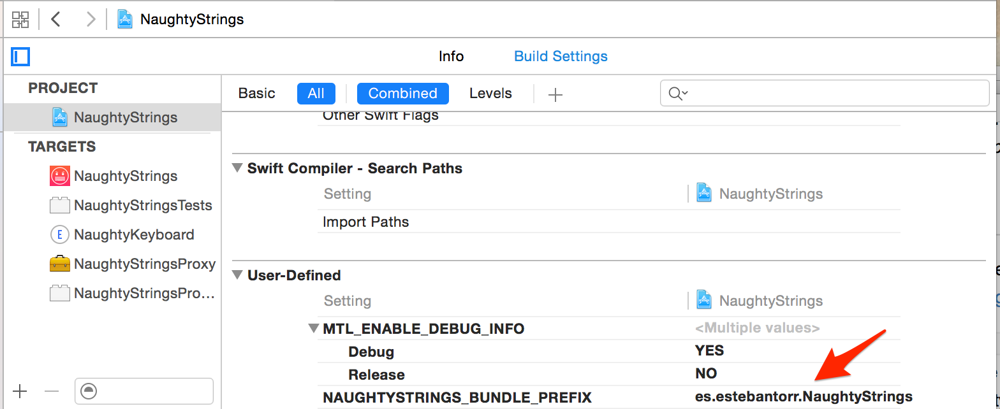

**[The Big List of Naughty Strings](https://github.com/minimaxir/big-list-of-naughty-strings)** is a list of strings which have a high probability of causing issues when used as user-input data.

I have put together these strings to create **Naughty Keyboard** – a very simple iOS app that gives you access to a custom keyboard to use these strings to test your application.

## Instructions 

Clone the app, run it from Xcode then activate the keyboard.
*I'm pretty sure Apple wouldn't allow me to put this on the App Store.*

## Setting up `AppGroup`
This project comes with a syncing mechanism to be able to be up-to-date with the latest strings from the [Big List of Naughty Strings][naughtyrepo].

The way this project is structured is by using `App Groups` and sharing the `UserDefaults` instance across the extension and the main app as well as the synced file with the naughty strings.

In order to do this there's a couple of things that need to be done before compiling and running the project:

1. Set the project’s bundle identifier prefix.
2. Select your development team.
3. Create provisioning profiles.

### 1. Set the Project’s Bundle Identifier Prefix
Open app `Xcode`, select `NaughtyStrings` project -> Build Settings and change the `User Defined` value `NAUGHTYSTRINGS_BUNDLE_PREFIX` to a globally unique reverse DNS string for your own
organization’s name.

### 2. Select Your Development Team
Select your paid iOS Developer Program account as the development team for each of the four targets below:

- NaughtyStrings
- NaughtyKeyboard
- NaughtyStringsProxy

### 3. Create Provisioning Profiles
Create a provisioning profile for each of the three targets below:

- NaughtyStrings
- NaughtyKeyboard
- NaughtyStringsProxy

Xcode helps you to create these provisioning profiles. First, select the `NaughtyStrings` project in `Xcode`'s project navigator. Then, for each of the three targets listed above:

1. Select the target in the Targets list.
2. Select the General tab in the right-hand pane.
3. In the Identity section, under the Team popup menu, click Fix Issue.
4. Xcode will download a new provisioning profile for that target. (This
process may take up to 30 seconds per target.)

## Disclaimer

The **Big List of Naughty Strings** (and this keyboard) is intended to be used for software you own and manage. Some of the *Naughty Strings* can indicate security vulnerabilies, and as a result using such strings with third-party software may be a crime. The maintainer is not responsible for any negative actions that result from the use of the list.

## Maintainer 

* Romain Pouclet ([palleas](https://github.com/palleas))

## License

`NaughtyKeyboard` may be freely distributed under the [MIT License](http://opensource.org/licenses/MIT). See the [`LICENSE`](https://raw.githubusercontent.com/Palleas/NaughtyKeyboard/master/LICENSE) file.

The application icon is based on icons [Tyler Glaude](https://thenounproject.com/term/angry/50733/) and [Herbert Spencer](https://thenounproject.com/term/keyboard/58315/) from The Noun Project. Used under a [Creative Commons BY 3.0](http://creativecommons.org/licenses/by/3.0/) license.

[naughtyrepo]:https://github.com/minimaxir/big-list-of-naughty-strings
